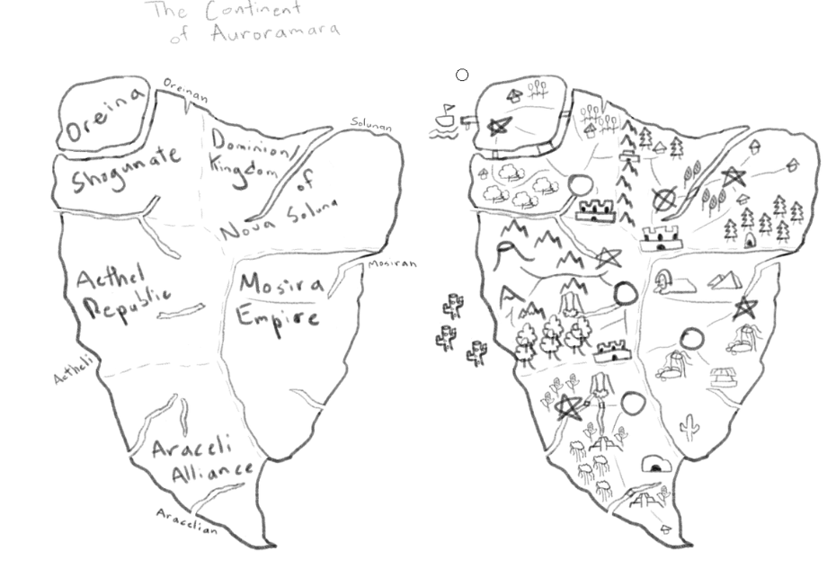
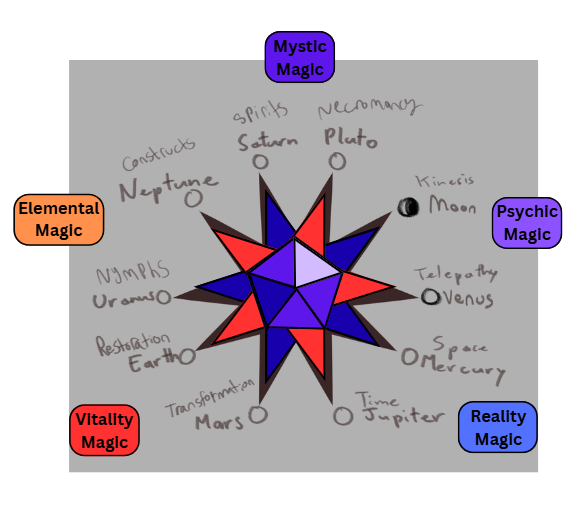

[Return to Front Page](index.md)

# Welcome to the World of Azure Star!

Azure Star is a story concept I have been developing for a few years. It is a medieval fantasy story with magic, action, and adventure. I'll give a brief synopsis: 

After losing her home during a violent rebellion, Neoma embarks on a journey of vengeance and political deception as she infiltrates the ranks of the magic academy to deliver justice. On her journey, Neoma, now known as Malina, will uncover hidden truths behind the rebellion, rediscover herself as she regains faith in allies, and venture the farthest reaches of the world.

The continent of Auroramara is home to five nations that were unified by the Goddess on her crusade to defeat the tyrannical Sun God. By rallying five champions from each of the regions of the continent, the Goddess and her Five Heroes rebelled against the Sun the defeated the tyrant. The Five Heroes became leaders of their respective homes under the Goddess.

The Kingdom of Nova Soluna is inspired by feudal Western Europe. The Oreina Shogunate is inspired by feudal Japan. The Mosira Empire is inspired by Egypt. The Araceli Alliance is inspired by the Aztec and Inca Empires. The Aether Republic is home to the various elemental elves, most of which are isolationist within nature except for the High Elves who are the ruling royalty and have Greek inspirations.

Magic comes from the gods of the Solar Pantheon. With the Goddess as the head, the other celestial bodies bless the people of Auroramara with magic if they have the affinity for it. Magic is split into five categories: Vitality, Elemental, Mystic, Psychic, and Reality. On the rare occurence someone awakens magic, they will likely only ever use simple applications of their affinity. Further blessings from the gods can awaken new avenues of their affinity, new magic affinities, or even advanced applications which can develop into divine blessings. The image above shows which advanced avenues of magic each god rules over.

