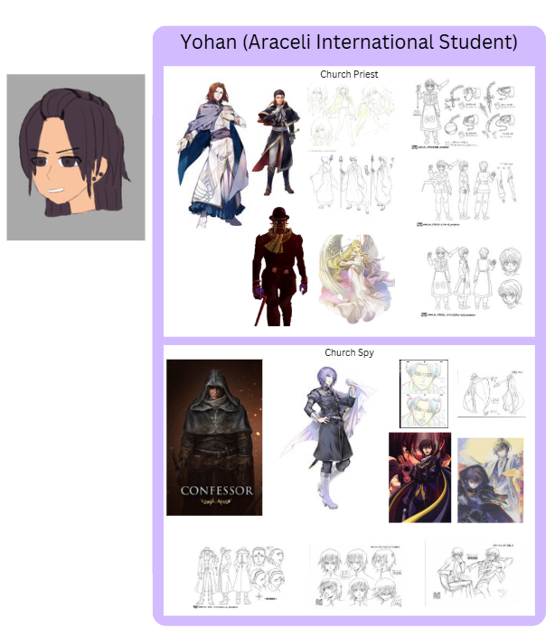
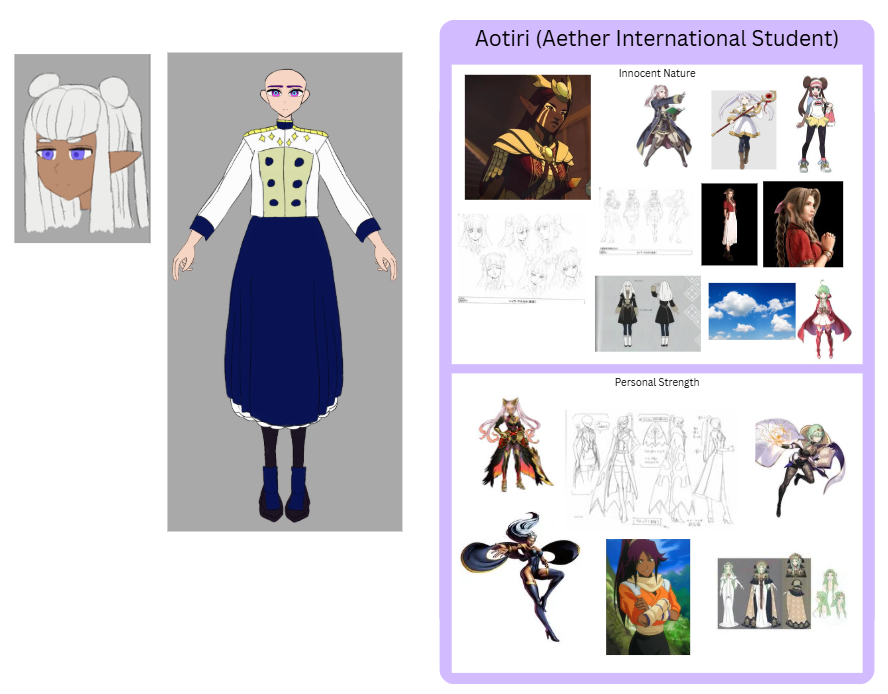
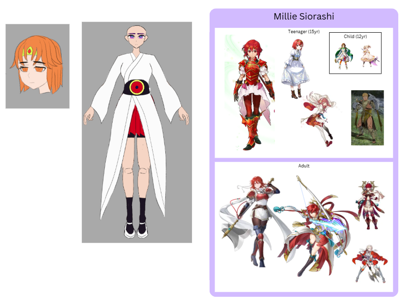
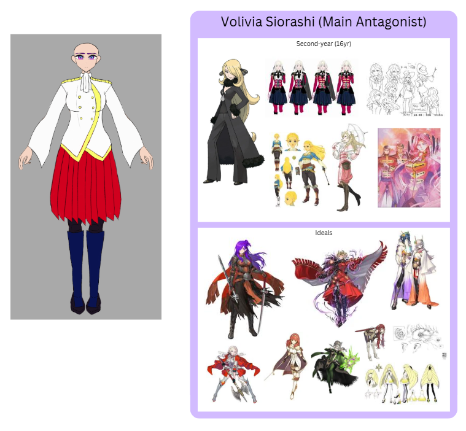
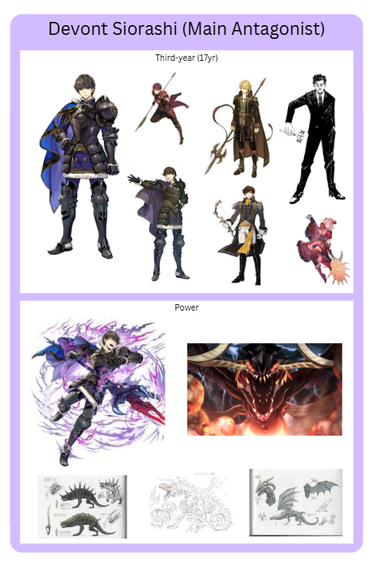

[Return to Front Page](index.md)

# Welcome to the World of Azure Star!

Azure Star is a story concept I have been developing for a few years. It is a medieval fantasy story with magic, action, and adventure. I'll give a brief synopsis: 

After losing her home during a violent rebellion, Neoma embarks on a journey of vengeance and political deception as she infiltrates the ranks of the magic academy to deliver justice. On her journey, Neoma, now known as Malina, will uncover hidden truths behind the rebellion, rediscover herself as she regains faith in allies, and venture the farthest reaches of the world.

## The Continent of Auroramara

The continent of Auroramara is home to five nations that were unified by the Goddess on her crusade to defeat the tyrannical Sun God. By rallying five champions from each of the regions of the continent, the Goddess and her Five Heroes rebelled against the Sun the defeated the tyrant. The Five Heroes became leaders of their respective homes under the Goddess.

The Kingdom of Nova Soluna is inspired by feudal Western Europe. The Oreina Shogunate is inspired by feudal Japan. The Mosira Empire is inspired by Egypt. The Araceli Alliance is inspired by the Aztec and Inca Empires. The Aether Republic is home to the various elemental elves, most of which are isolationist within nature except for the High Elves who are the ruling royalty and have Greek inspirations.

## The Magic System

Magic comes from the gods of the Solar Pantheon. With the Goddess as the head, the other celestial bodies bless the people of Auroramara with magic if they have the affinity for it. Magic is split into five categories: Vitality, Elemental, Mystic, Psychic, and Reality. 

On the rare occurence someone awakens magic, they will likely only ever use simple applications of their affinity. Further blessings from the gods can awaken new avenues of their affinity, new magic affinities, or even advanced applications which can develop into divine blessings. The image above shows which advanced avenues of magic each god rules over.

The Goddess also bestowed divine blessings upon the Five Heroes and their bloodline. Notable ones are the "All-Seeing Eye" of Oreinan royal family and the "Enlightened Avatar" of the Nova Soluna nobility. These divine blessings hold great magical and political power in the continent.

## The Main Characters

Neoma is the main character of the story. She was an ambitious and passionate child of Nova Solunan nobility turned reserved and vengeful after her experiences in the war. She lives under the name of her childhood friend Malina to search for revenge against those who took her parents' lives.

Leoryo is a false noble of Nova Soluna forced into the political battle of the kingdom's next ruler. He has to ensure he obtains political power or else he'll outlive his usefulness, but since he obviously doesn't have noble blood, he'll have to find other methods of obtaining the throne. 

Yohan is an Aracelian international student and a devout follower of the religion of the Azure Star. Due to being a priest of the Church, he is under suspicion from Neoma and Leoryo as a spy to watch them. In truth, he is a spy, but is not as blindly devout as he may seem.

Aotiri is an Aetheli international student from the snow elf clan. Born from a marriage between a snow and fire elf, she holds the unique elemental ability of clouds. She is very innocent and cheery compared to her allies, making her feel insecure about her own naivety and childishness.

Millie is the fourth child and the youngest of the Oreinan royal family. She was a very physically strong and bold child until an incident in the war caused her to recognize her own brutish strength and weakness, a trauma that developed from her shared history with Malina, who Neoma feigns understanding.

Volvia is the third child of the Oreinan royal family and a main antagonist for she was responsible for the death of Neoma's mother. She is a very conflicted person about her role for her nation, but masks it with a sense of regality. Despite her magical talent, she deeply wishes to awaken the All-Seeing Eye.

Devont is the second child of the Oreinan royal family and a main antagonist for he was responsible for the death of Neoma's father. He has a noble presence and strongly believes in truth and justice. His sense of self is very important to his character, which will be tested as reveals about his past shake him.

## Prologue

After the war of the Five Heroes and the soon-to-be Goddess against the tyrannical Sun God, the continent of Auroramara is unified by the High Elves’ Central Church and five nations that are ruled by the Five Heroes. Under the religion of the Azure Star, the Goddess is praised as the main deity and the other celestial bodies of the solar system praised as gods amongst the pantheon. Soon, the Goddess gave her five champions divine blessings that would be passed onto their bloodline, and give her own life to split the continent from other warmongers and create a barrier to protect Auroramara.

Set 1,000 years after the war, in the Kingdom of Nova Soluna, the protagonist, Neoma (11yrs), is a noble daughter of the House of Falnadari, accompanying her friend Malina (11yrs), a noble daughter of the House of Mistyaval. They travel with their mothers to visit the nation’s magic academy to learn their magic affinities. They learn they share the magic affinity of Reality magic, specifically Neoma has conjuration and Malina can create barriers. Neoma practices by conjuring simple daggers and seems to have a better knack with magic, while Malina is weaker and requires more focus, but Neoma encourages her efforts. Neoma is very ambitious and passionate while Malina is very shy and reserved, but they value their friendship and can’t wait to revisit the magic academy when they are older.

Unfortunately, within a year, rising tensions between the noble houses of Nova Soluna and its royal family causes a rebellion in the capital. The king and the noble orchestrators of the rebellion died during the battle, but the remaining noble houses are also declared traitors for being a part of the scheme. With the royal family dead or missing, the Central Church calls upon the neighboring nations to restore peace and capture the traitors, dead or alive. 

The Oreina Shogunate sends its four children as generals in the lands of Neoma and Malina’s family. In the decisive battle against the Oreinan royal family, Neoma’s father and Malina’s father die in the battle, Malina is gravely injured causing her mother to surrender, and Neoma retreats with her mother to a village hideout. Neoma grieves for abandoning her father to die and is unsure of Malina’s fate. She doesn’t want to abandon anyone ever again, even if it means to die fighting, but it is naive for her to believe that when she doesn’t even understand the entire scope of the rebellion or the war. Despite being hidden, the Oreinan army finds the raids the village. Neoma wants to fight alongside her mother, but her mother knows that this will probably be the end for them and tells Neoma to run away, but she doesn’t listen. Within Neoma, her mother senses that her emotional state is beginning to awaken her divine blessing. Neoma’s mother knows if she awakens then she will fight and in her inexperience will die. In order for Neoma to listen to her, she makes a deal with a disturbing dark magic to seal the divine blessing and curse her daughter to live, sacrificing her life for it. Cursed to live, Neoma is possessed by the curse and forced to run away while her mother uses her last lingering will to fight off the Oreinan army.

Neoma tries to survive in the wilderness, avoiding soldiers, possessed to steal food, and take human or animal lives for survival. She cannot fathom why her mother would curse her to live, and wants revenge against whoever did this to them, but all she can do is survive. After weeks, she runs into a village with injured soldiers and survivors. As she tries to take rations from the village, the woman in charge catches Neoma and recognizes her for she is Malina’s mother. Neoma collapses having finally found someone she can be vulnerable with and takes refuge. She meets Malina bedridden from her injuries. They tell Neoma that the Church wishes to use them as political pawns and have them awaken their divine blessing to assume the throne, but Malina will be too weak to do such a thing and likely to die. Malina knows the Church will continue to hunt down Neoma as another potential pawn and if Malina dies then her mother would lose leverage. Instead, Malina offers that Neoma takes her place when she dies, pretending to be her. It is an insane request, but it is the only possible choice. Neoma replaces Malina, and learns to copy her powers and mannerisms.

Neoma and Malina’s mother have a conversation on what Neoma wants to do, and she wants revenge against those who killed her parents. Malina’s mother reveals who specifically killed her parents: Devont Siorashi killed her father and Volivia Siorashi killed her mother. When Neoma is old enough, she will go to the magic academy of Oreina and be students alongside these royals. If she wanted revenge, it would be then. Neoma practiced as Malina for the next three years as the war was ending, preparing to fool her political enemies. Soon, it was time for her Neoma (15yr), now as Malina, to go to the magic academy like she dreamed of all those years ago.

Throughout the story, Neoma will meet her enemies, make new allies and connections, learn more about the Church, higher powers, and the truth behind the conflicts. She will change as a person, realizing her own flaws and faults, become involved in another greater conflict, and travel the outside world.

[Return to Front Page](index.md)
